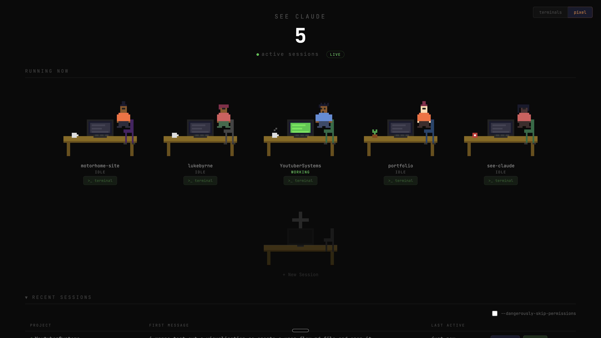
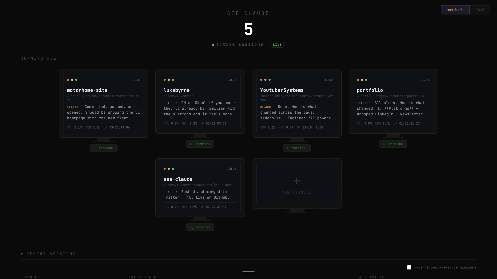

# See Claude

A tiny dashboard that shows all your running [Claude Code](https://docs.anthropic.com/en/docs/claude-code) sessions in one place. See which projects they're in, whether they're working or idle, and click to jump straight to that terminal.





## What It Does

- Detects all running Claude Code sessions on your machine
- **Two views**: terminal cards or pixel art characters at desks
- Status indicators: **green** = actively working, **yellow** = thinking, **grey** = idle
- Click any session to expand it with full conversation history
- Send messages to Claude sessions directly from the dashboard
- Click to focus that Terminal tab (macOS only)
- Launch new sessions with a directory browser
- Resume recent sessions with one click
- `--dangerously-skip-permissions` toggle for resume/launch
- Auto-refreshes via server-sent events

## Requirements

- **macOS** (uses `lsof` and AppleScript for terminal focus)
- **Node.js** v18 or higher
- At least one running Claude Code session

## Quick Start

```bash
git clone https://github.com/lukejbyrne/see-claude.git
cd see-claude
node server.js
```

Then open **http://localhost:3456** in your browser.

That's it. No dependencies to install.

## How It Works

1. Uses `pgrep` to find running `claude` processes
2. Uses `ps` and `lsof` to get each session's working directory, CPU, memory, and uptime
3. Reads session files from `~/.claude/projects/` for conversation history and status
4. Serves a single-page dashboard on port 3456 with live updates via SSE
5. When you click a session, it uses AppleScript to find and focus the matching Terminal tab

## Zero Dependencies

This is a single `server.js` file using only Node.js built-in modules (`http`, `child_process`, `path`, `fs`, `os`). No `npm install` needed.

## License

MIT
